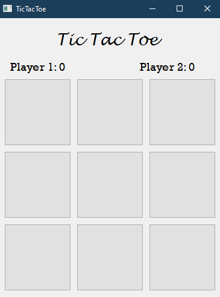
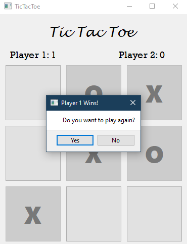

#Tic Tac Toe

This is a simple two player Tic Tac Toe game built using python 

For this, you will require Python's GUI library PyQT5. To install this, run the below command.
> pip install pyqt5

Snapshots:

